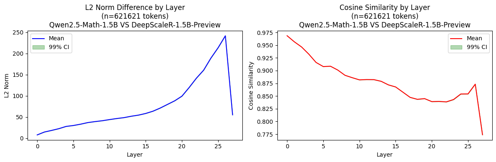
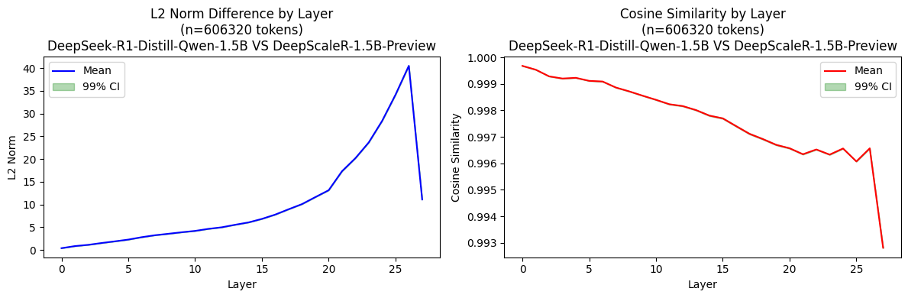
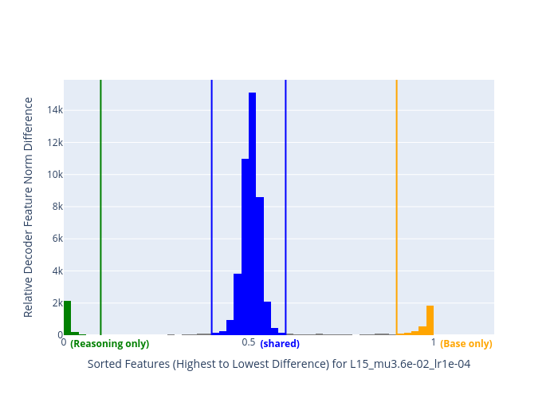
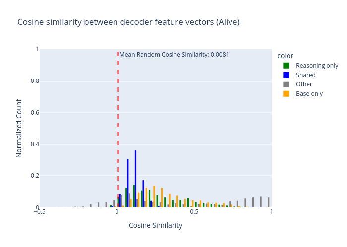

# Diffing Reasoning Models on Math

## Summary

I trained a crosscoder to diff the representations of a reasoning model ([DeepScaleR-1.5B-Preview](https://huggingface.co/agentica-org/DeepScaleR-1.5B-Preview)) and base model ([Qwen2.5-Math-1.5B](https://huggingface.co/Qwen/Qwen2.5-Math-1.5B)) on the math reasoning dataset ([OpenR1-Math](https://huggingface.co/datasets/open-r1/OpenR1-Math-220k)).

I found that the reasoning model has specific features that seem more related to the reasoning process in general (such as "reason step by step", determining the order of operations, formatting instructions, rules and laws), while the base model's specific features react to more concrete and simpler objects and features of input (such as numbers, special symbols, and letters). 

Out of the three layers I examined, *layer 15 had the most interpretable features*, whereas *layer 25 had the least*. There's a sense of progression in the features as we go from layer 15 to 25 - the features become more general and less interpretable. The token activations for many of the layer 25 features are more spread out across the input, and these features are more similar to each other.

Below are some features I found especially interesting from **layer 15**.

**14415 (Reasoning only) - "reason step by step"; order of operations; minimum/maximum**

**44797 (Reasoning only) - rules, formulas, laws**

**30659 (Base only) - letter b**

**8236 (Base only) - number 2**

## Full report

### Motivation

In this project, I'm exploring the following questions:

- How do the internal representations of reasoning models differ from their base versions?
- What new features emerge after reasoning distillation or RL training?
- Can we identify specific features responsible for mathematical reasoning capabilities?

Understanding these differences could help us better characterize how reasoning capabilities are implemented in neural networks.

### Models

As a reasoning model, I used [DeepScaleR-1.5B-Preview](https://huggingface.co/agentica-org/DeepScaleR-1.5B-Preview). It is based on [DeepSeek-R1-Distill-Qwen-1.5B](https://huggingface.co/deepseek-ai/DeepSeek-R1-Distill-Qwen-1.5B) with additional RL training to make it better at math. 

My choice was motivated by two reasons:   
a) It's the *smallest available reasoning distillation* that I can reliably run on the machines I have access to  
b) It's *superior to the original distilled model* in terms of math performance and has undergone additional RL training, which makes it more likely we'll find interesting math-reasoning related features  

As a base model I used [Qwen2.5-Math-1.5B](https://huggingface.co/Qwen/Qwen2.5-Math-1.5B) - this is the model DeepSeek-R1-Distill-Qwen-1.5B is based on.

DeepScaleR's and Qwen2.5's tokenizers produce different numbers of tokens for the same input, so I had to choose the one that reduces performance the least for both models. I [evaluated the tokenizer's effect on loss on 1000 samples](https://github.com/mitroitskii/interp-experiments/blob/main/reasoning_diff_project/4.%20evaluate_tokenizer.py) of the crosscoder training dataset and found somewhat surprising results: the *base model performed better with the distilled tokenizer* (loss **0.7630** vs **0.9016**) and the *distilled model performed better with the base tokenizer* (loss **0.9401** vs **0.9240**). 

Empirically, when running both models with the base tokenizer, they both performed well – for the chosen dataset, the distilled model returns answers close to expected. As such, I chose the *base tokenizer for the crosscoder training*.

To save memory, I ran the models in **bf16 precision**. When tested, both models performed similarly in bf16 and full precision.

### Data

[OpenR1-Math](https://huggingface.co/datasets/open-r1/OpenR1-Math-220k) is a set of reasoning traces sourced from full DeepSeek R1 run on the NuminaMath 1.5 dataset. At the time of the experiment, it was the *highest quality math reasoning dataset available*.

I considered mixing in base web data with the math dataset - for the crosscoder to learn general features in addition to math features - but decided against it to save time, and because both models are finetuned on math data (DeepSeek-R1-Distill-Qwen-1.5B is based on Qwen2.5-Math-1.5B, not on base Qwen2.5-1.5B).

I compared the average length of full reasoning traces and just the final answers (after the closing `<think>` tag). For full reasoning traces, **73%** of the samples are longer than **3000 tokens**. Whereas for extracted answers, **94%** of the samples have a length under **1024 tokens**. Due to memory constraints on available GPUs, I decided to train the crosscoder only on the final answers, leaving out the reasoning traces. The maximum length of the input was set to **1024 tokens**.

I [preprocessed the dataset](https://github.com/mitroitskii/interp-experiments/blob/main/reasoning_diff_project/1.%20dataset_openr1_preprocess.py) in the following way:
- The dataset contains generations that lead to both correct and incorrect solutions. I decided to use both, since the correctness shouldn't matter for eliciting the reasoning features that the model developed
- Filtered for complete generations (assuming DeepSeek did their distillation only on complete generations)
- Added a prefix "Please reason step by step, and put your final answer within \\boxed{}." This is a prefix recommended by DeepSeek to use for math reasoning and is how the model was trained
- Split the dataset into train and test sets (**70%/30%**)
- [Applied the chat template](https://github.com/mitroitskii/interp-experiments/blob/main/reasoning_diff_project/2.%20dataset_apply_chat_template.py) of the base tokenizer

### Training 
I [forked and modified](https://github.com/mitroitskii/dictionary_learning/tree/reasoning_diff) [jkminder's version](https://github.com/jkminder/dictionary_learning) of the crosscoder training code to work with an activation buffer on multiple models instead of activations caching.

The model has **28 layers** in total. I ran an experiment to [compare the average norm of the difference in activations](https://github.com/mitroitskii/interp-experiments/blob/main/reasoning_diff_project/5.%20find_most_divergent_layer.py) between the base and distill models for each layer.

As a baseline, I also compared the norm difference between DeepSeek-R1-Distill and DeepScaleR-1.5B. Notice how the norm difference is much lower (**max 40** vs **max 250**).

Partially informed by these results, I picked layers **15**, **20**, and **25** to train on. Layer **25** is where we see the norm difference between the models peaking. However, from literature and previous [experience](https://arxiv.org/abs/2305.01610), I expected the most interpretable features to be in the middle layers, so I chose layer **15** as the middle and **20** as the one in-between with a relatively high norm difference.

For **L1 penalty** and **learning rate**, I used the values that Julian Minder and Clement Dumas [used to train the crosscoder on the base vs chat Qwen2.5-1.5b](https://wandb.ai/jkminder/crosscoder/runs/9lothqg9/overview) – **3.6e-02** and **1e-04** respectively. The crosscoder hidden dimension is **32x** that of the models' (49152 = 1536 * 32).

I ran the training on **150 million tokens** for each crosscoder.

The full config can be found [here](https://huggingface.co/mitroitskii/Crosscoder-Qwen2.5-1.5B-vs-DeepScaleR-1.5B/blob/main/L15/config.json).

### Evaluation

I evaluated the model on **5 million tokens** with fraction of variance explained of **0.98**, **0.95**, and **0.87** for layers **15**, **20**, and **25** respectively.

I computed the relative crosscoder decoder feature norm difference and cosine similarity between decoder feature vectors. While the pattern for the norm difference is as expected and shows distinct features for each model, the cosine similarity is very low on average and is lower for shared features than for specific ones.

Here are the results for the crosscoder trained on **layer 15**:

The results for all crosscoders can be found in the [plots/feature_analysis](https://github.com/mitroitskii/interp-experiments/tree/main/reasoning_diff_project/plots/feature_analysis) directory of the main repo.

### Feature Analysis

For each trained crosscoder, I [collected](https://github.com/mitroitskii/interp-experiments/blob/main/reasoning_diff_project/8.%20collect_max_activating_examples.py) the maximally activating examples for each feature and sorted them by decoder norm difference.

I [examined the maximally activating examples](https://github.com/mitroitskii/interp-experiments/blob/main/reasoning_diff_project/9.%20analyze_max_activating_examples.ipynb) for **~100 features** among the top 400 sorted by decoder norm difference for each crosscoder.

From these examples, I found that the *reasoning model has specific features related to the reasoning process* in general (such as "reason step by step", determining the order of operations, formatting instructions, rules and laws), while the *base model's specific features react to more concrete and simpler objects**and features of input (such as numbers, special symbols, and letters). 

Out of the three layers, *layer 15 had the most interpretable features*, whereas *layer 25 had the least*. There's a sense of progression in the features as we go from layer 15 to 25 - the features become more general and less interpretable. The token activations for many of the layer 25 features are more spread out across the input, and the features are more similar to each other.

Below are the features that I found interesting for each layer.

#### Layer 15

##### Reasoning only

**14415 - "reason step by step"; order of operations; minimum/maximum**

**44797 - rules, formulas, laws**

**41853 - put answer in the \boxed{}**

**24463 - identifier feature for what kind of problem this is?**

**43201 - spaces between the numbers**

##### Base only

**30659 - letter "b"**

**8236 - number 2**

**48940 - backslash**

**47905 - letter "x"**

#### Layer 20

Most features I checked seem to be very multimodal and not obviously interpretable; related to some form of reasoning, parts of the problem-solving process.

Here is an example of a feature that seems to be related to the problem-solving process:

#### Layer 25

##### Reasoning only

**276 - related to the final answer**

##### Base only

**311, 44966, 48203 - not obviously interpretable; seems to track a limited set of entities**

### Limitations

I have not established a baseline for feature analysis by looking at the maximally activating examples for features shared between the base and distill models.

Another substantial limitation is that I have not trained the crosscoder on reasoning traces or mixed in any other kind of data to the math dataset.

### Next Steps

Here's what I'm planning to explore next:

1. **Dataset improvements**
   - Train on full reasoning traces instead of just answers
   - Consider mixing in other data types to provide more context

2. **Additional analysis**
   - Examine shared features to establish a baseline for comparison
   - Compare DeepSeek-R1-Distill-Qwen-1.5B vs DeepScaleR-1.5B-Preview to isolate effects of RL training
   - Compare base Qwen2.5-Math-1.5B vs DeepSeek-R1-Distill-Qwen-1.5B to isolate effects of distillation

### Code and Resources
1. [All scripts for data processing, experiments, max activating examples generation, analysis, and resulting plots](https://github.com/mitroitskii/interp-experiments/tree/main/reasoning_diff_project)
2. [Dataset for crosscoder training](https://huggingface.co/datasets/mitroitskii/OpenR1-Math-220k-formatted)
3. [Crosscoder training code](https://github.com/mitroitskii/dictionary_learning/tree/reasoning_diff) (forked and modified from [jkminder's version](https://github.com/jkminder/dictionary_learning))
4. [Trained crosscoders for layers 15, 20 and 25 and their configs](https://huggingface.co/mitroitskii/Crosscoder-Qwen2.5-1.5B-vs-DeepScaleR-1.5B)
5. [Dictionaries of max activating examples for each crosscoder and feature dataframes](https://huggingface.co/datasets/mitroitskii/Crosscoder-Qwen2.5-1.5B-vs-DeepScaleR-1.5B_max_activating_examples) 